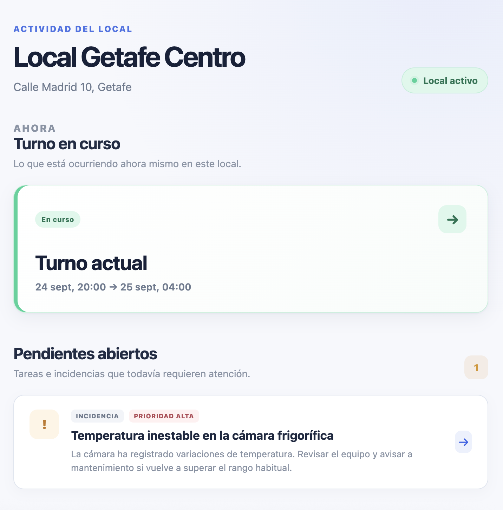
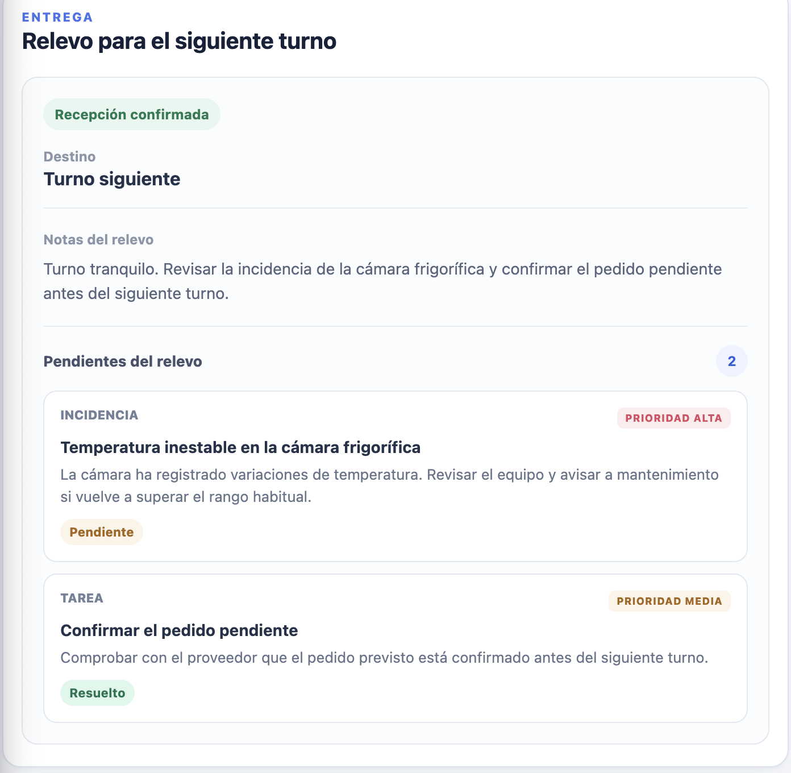
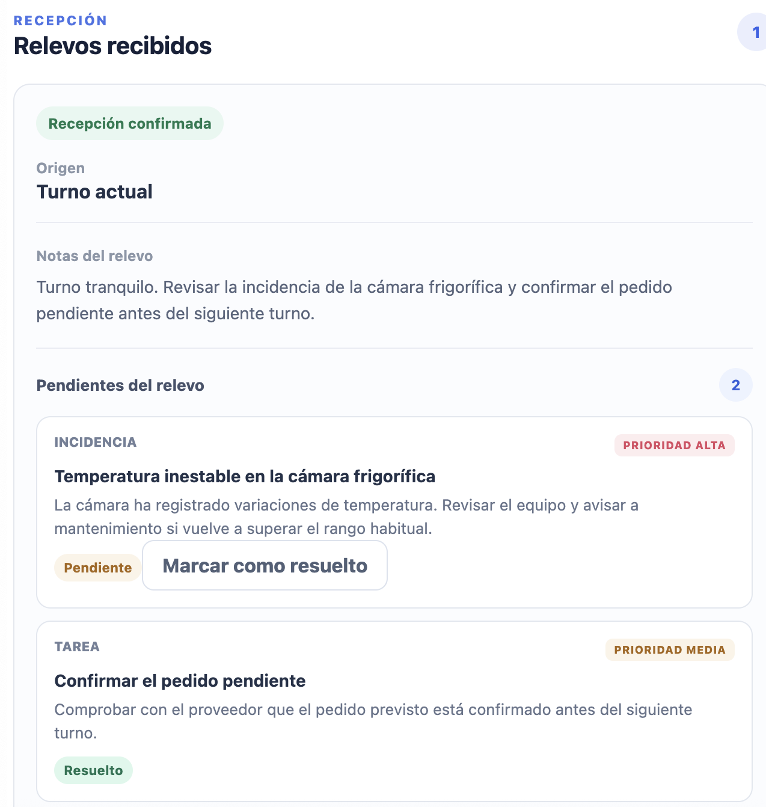
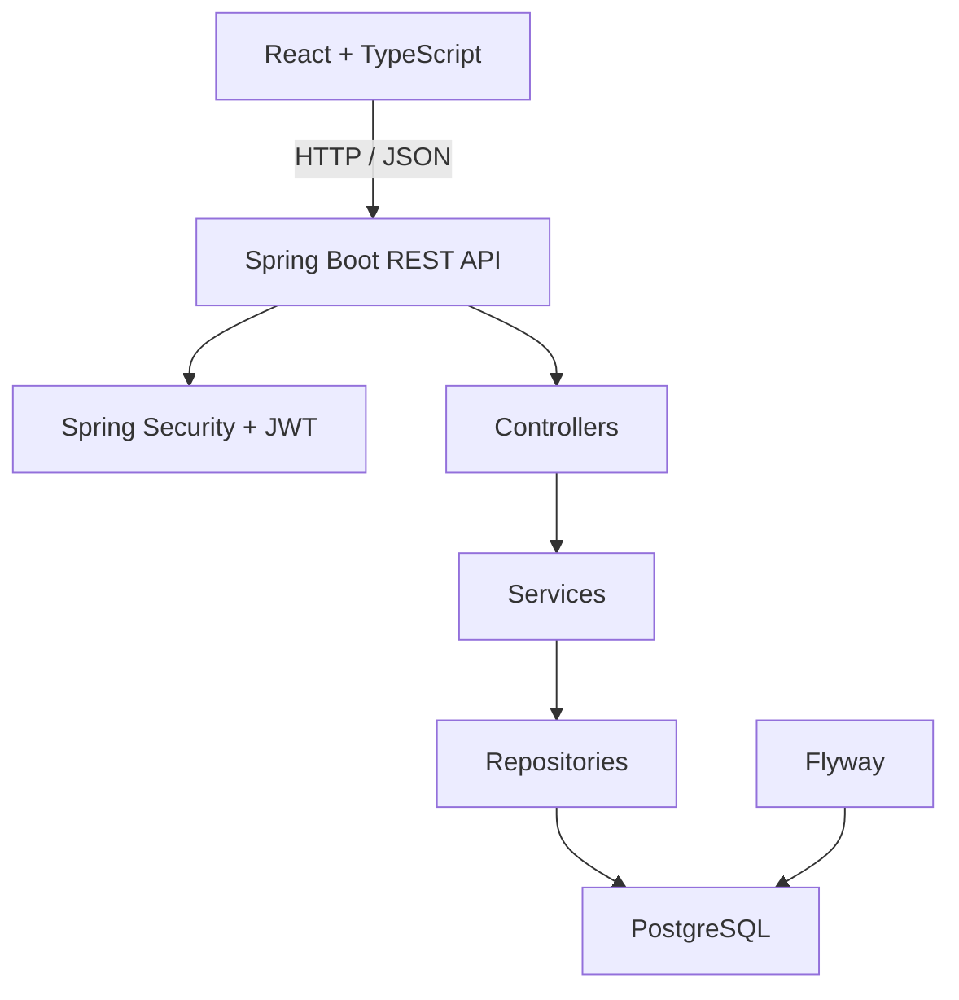

# ShiftLink

ShiftLink es una plataforma Full Stack para gestionar relevos de turno y mantener la continuidad operativa entre equipos.

Centraliza incidencias, tareas pendientes, contexto operativo y confirmaciones de recepción para evitar que la información importante se pierda cuando termina un turno y comienza el siguiente.

## Demo pública

Prueba la aplicación sin registrarte:

<a href="https://shiftlink-tldu.onrender.com">Abrir demo pública</a>

Pulsa **Entrar en demo**.

Cada visitante recibe un entorno de demostración independiente con empresa, local, turnos, empleados, relevos, incidencias y tareas de ejemplo. Los cambios realizados en una demo no afectan a otros visitantes.

> El backend está desplegado en el plan gratuito de Render, por lo que la primera petición puede tardar unos segundos si el servicio estaba inactivo.

## Vista del producto

### Actividad del local

Vista general del turno en curso y de los asuntos que todavía requieren atención.



### Relevo entre turnos

El turno saliente entrega contexto, incidencias y tareas al siguiente equipo.



### Recepción y continuidad

El turno receptor consulta el relevo, mantiene el estado de los pendientes y puede resolverlos.



---

## Qué problema resuelve

En muchos equipos, el cambio de turno todavía depende de mensajes, notas, comunicación verbal o grupos informales. Eso puede provocar pérdida de información, tareas olvidadas y poca trazabilidad.

ShiftLink estructura el proceso alrededor de una relación clara:

```text
Empresa
  ↓
Local
  ↓
Turno
  ↓
Relevo
  ↓
Incidencias y tareas
```

## Flujo principal

```text
Empleado trabaja en un turno
          ↓
Registra incidencias y tareas
          ↓
Prepara el relevo
          ↓
Selecciona el turno de destino
          ↓
Envía el relevo
          ↓
El siguiente turno lo recibe
          ↓
Confirma la recepción
          ↓
Resuelve los pendientes
          ↓
Los asuntos abiertos pueden continuar
en el siguiente relevo
```

## Funcionalidades principales

### Empresas y permisos

- Arquitectura multiempresa mediante membresías.
- Roles `OWNER`, `MANAGER` y `EMPLOYEE`.
- Control de acceso por empresa.
- Reglas de autorización adicionales en la capa de servicios.

### Locales y turnos

- Gestión de locales o centros de trabajo.
- Creación y edición de turnos.
- Asignación de empleados.
- Prevención de asignaciones duplicadas.
- Ciclo de vida de turnos: `SCHEDULED`, `ACTIVE`, `COMPLETED` y `CANCELLED`.

### Relevos

- Creación de relevos entre turnos.
- Edición mientras permanecen en borrador.
- Selección del turno receptor.
- Envío del relevo.
- Confirmación de recepción.
- Estados `DRAFT`, `SUBMITTED` y `ACKNOWLEDGED`.

### Incidencias y tareas

- Tipos `INCIDENT` y `TASK`.
- Prioridades `LOW`, `MEDIUM` y `HIGH`.
- Estados `OPEN` y `RESOLVED`.
- Continuidad de pendientes no resueltos entre turnos.
- Trazabilidad del estado de cada asunto.

## Demo aislada por visitante

La demo pública no utiliza una cuenta compartida.

Cuando un visitante pulsa **Entrar en demo**, el backend crea automáticamente un entorno independiente con:

```text
Usuario demo
    ↓
Empresa independiente
    ↓
Local
    ↓
3 turnos
    ↓
Empleados
    ↓
Asignaciones
    ↓
Relevos
    ↓
Incidencias y tareas
```

Cada sesión recibe su propio JWT y sus propios datos.

Las demos son temporales y el backend incluye limpieza de sesiones caducadas, límite de sesiones activas y protección frente a creación excesiva de demos.

## Stack tecnológico

### Frontend

- React
- TypeScript
- Vite
- CSS
- Fetch API
- PWA
- Diseño responsive

### Backend

- Java 21
- Spring Boot
- Spring Web MVC
- Spring Security
- OAuth2 Resource Server
- JWT
- Spring Data JPA
- Hibernate
- Bean Validation
- Maven

### Base de datos

- PostgreSQL
- Flyway

### Infraestructura

- Docker
- Docker Compose
- Render
- Neon PostgreSQL
- GitHub Actions
- Git

## Arquitectura



El frontend no accede directamente a PostgreSQL. La lógica de negocio, validaciones y reglas de autorización se ejecutan en el backend.

## Seguridad

ShiftLink utiliza autenticación stateless mediante JWT Bearer Token.

```http
Authorization: Bearer <JWT>
```

La aplicación utiliza:

- BCrypt para almacenar contraseñas.
- JWT firmado mediante HMAC SHA-256.
- Spring Security.
- OAuth2 Resource Server.
- Control de acceso mediante membresías y roles.
- Comprobaciones de autorización en la capa de servicios.

Endpoints públicos principales:

```text
POST /api/auth/register
POST /api/auth/login
POST /api/auth/demo
GET  /api/health
```

## Modelo de datos

Principales entidades:

```text
users
companies
memberships
locations
shifts
shift_assignments
handovers
handover_items
```

El esquema se gestiona mediante migraciones versionadas con Flyway.

## Reglas de negocio destacadas

- Un turno debe finalizar después de comenzar.
- Solo determinados estados permiten modificar un turno.
- Las asignaciones duplicadas están bloqueadas.
- Solo usuarios autorizados pueden gestionar empleados.
- Un usuario debe estar asignado al turno para crear su relevo.
- Un turno no puede tener varios relevos de salida.
- El turno de origen y el de destino deben ser diferentes.
- Un relevo enviado deja de ser editable.
- Solo un usuario asignado al turno receptor puede confirmar la recepción.
- El creador del relevo no puede confirmarlo como receptor.
- Los pendientes mantienen su estado durante el traspaso.
- Los asuntos abiertos pueden continuar en relevos posteriores.

## Testing

El backend dispone actualmente de **28 tests automatizados** con JUnit 5, Mockito, AssertJ y Spring Boot Test.

La suite cubre, entre otras áreas:

- Ciclo de vida y edición de turnos.
- Asignaciones duplicadas.
- Membresías inactivas.
- Permisos.
- Creación, envío y confirmación de relevos.
- Restricciones de edición.
- Continuidad de pendientes.
- Prevención de duplicados.
- Creación de demos independientes.
- Limitación de sesiones demo.
- Respuesta HTTP `429` al superar límites.

Ejecutar:

```bash
cd backend
./mvnw test
```

## Integración continua

GitHub Actions valida cada cambio sobre `main`.

Backend:

```text
PostgreSQL
Java 21
Flyway
Maven
Tests
```

Frontend:

```text
Node.js
npm ci
ESLint
TypeScript
Vite build
```

## Despliegue

La aplicación está desplegada actualmente con:

```text
Frontend
React + TypeScript
Render Static Site
        ↓
Backend
Spring Boot + Docker
Render Web Service
        ↓
Database
PostgreSQL
Neon
```

### Producción

Frontend / Demo:

<a href="https://shiftlink-tldu.onrender.com">Abrir demo pública</a>

Backend:

<a href="https://shiftlink-api.onrender.com">Ver backend desplegado</a>

## Ejecutar en local

### Requisitos

- Java 21
- Node.js
- npm
- Docker
- Docker Compose
- Git

### 1. Clonar

```bash
git clone https://github.com/Geremias93/shiftlink.git
cd shiftlink
```

### 2. Configurar variables

```bash
cp .env.example .env
```

Generar un secreto JWT:

```bash
openssl rand -hex 32
```

Añadirlo a `.env`:

```text
JWT_SECRET=valor_generado
```

### 3. PostgreSQL

```bash
docker compose up -d postgres
```

### 4. Backend

```bash
cd backend
set -a
source ../.env
set +a
./mvnw spring-boot:run
```

Backend:

```text
http://localhost:8080
```

### 5. Frontend

En otra terminal:

```bash
cd frontend
npm ci
npm run dev
```

Frontend:

```text
http://localhost:5173
```

## Estructura

```text
shiftlink/
├── backend/
│   ├── src/main/java/
│   ├── src/main/resources/
│   │   └── db/migration/
│   └── src/test/
├── frontend/
│   └── src/
│       ├── components/
│       ├── services/
│       ├── types/
│       └── utils/
├── .github/
│   └── workflows/
├── docker-compose.yml
├── .env.example
└── README.md
```

## Aspectos técnicos que demuestra el proyecto

ShiftLink se ha desarrollado para trabajar sobre problemas habituales en aplicaciones empresariales:

- Diseño de APIs REST.
- Arquitectura backend por capas.
- Autenticación y autorización.
- Arquitectura multiempresa.
- Modelado relacional.
- Gestión de estados.
- Reglas de negocio.
- Integridad de datos.
- Migraciones.
- Testing automatizado.
- Integración continua.
- Contenedores.
- Despliegue cloud.
- Integración frontend/backend.
- Creación automática de entornos de demostración aislados.

## Próximas mejoras

Posibles evoluciones futuras:

- Archivos adjuntos y fotografías.
- Sistema de invitaciones.
- Funcionalidades adicionales para responsables.
- Mejoras de navegación y experiencia de usuario.
- Entrada de información mediante voz.
- Evaluación de funcionalidades asistidas por IA.

Estas mejoras no son necesarias para el funcionamiento del MVP actual.

## Autor

**Geremias93**

Software Developer

Java · Spring Boot · PostgreSQL · React · TypeScript · React Native

GitHub: https://github.com/Geremias93
